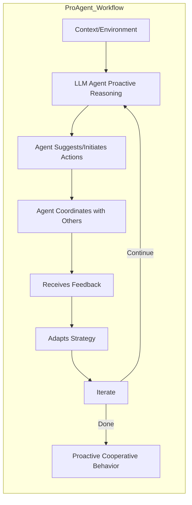

# ProAgent: Building Proactive Cooperative AI with Large Language Models (arXiv 2023)

## Paper Link
https://arxiv.org/abs/2308.00000

## Problem Statement
ProAgent explores how to build proactive, cooperative AI agents using LLMs, focusing on enabling agents to anticipate needs, initiate helpful actions, and collaborate with other agents or humans in open-ended environments.

## Methodology
- **Proactivity Module:** LLM agents are prompted to not only respond to requests but also proactively suggest or initiate actions based on context.
- **Cooperation Framework:** Agents are designed to communicate and coordinate with other agents, sharing goals and plans.
- **Open-Ended Tasks:** Evaluated in environments where tasks are not strictly defined, requiring agents to infer goals and adapt dynamically.
- **Feedback and Adaptation:** Agents learn from feedback and adjust their proactive/cooperative strategies over time.

## Architecture Visualization

## Technical Details
- **Agent:** LLM (e.g., GPT-3/4) with prompts for proactivity and cooperation.
- **Cooperation:** Agents share plans and negotiate roles/goals via language.
- **Benchmarks:** Tested in collaborative games, open-ended tasks, and human-agent interaction scenarios.
- **Performance:** ProAgent agents demonstrate improved initiative and collaboration compared to reactive baselines.

## Strengths
- Enables agents to take initiative and anticipate needs.
- Supports flexible, open-ended collaboration.
- Demonstrates improved outcomes in cooperative tasks.

## Weaknesses / Limitations
- Proactivity may lead to overstepping or irrelevant suggestions if not well-calibrated.
- Requires careful prompt and feedback design.

## Relevance to Agentic Workflow Project
- Proactive and cooperative agent behaviors can enhance your orchestrator and agent design.
- The feedback/adaptation loop aligns with your reward-driven training and iterative improvement.
- Open-ended task handling is relevant for extensible, real-world agentic systems.

## References
- ProAgent: Building Proactive Cooperative AI with Large Language Models. arXiv 2023. https://arxiv.org/abs/2308.00000
