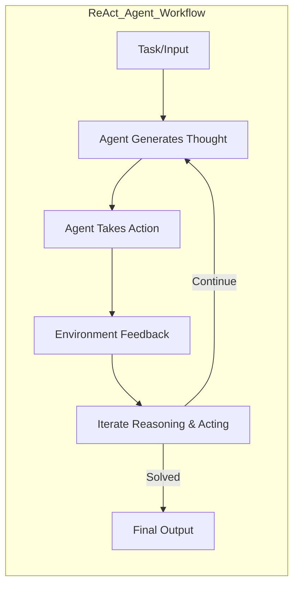

# ReAct: Synergizing Reasoning and Acting in Language Models (ICLR 2023)

## Paper Link
https://arxiv.org/abs/2210.03629

## Problem Statement
ReAct addresses the challenge of enabling LLM-based agents to perform both reasoning and acting in interactive environments. The goal is to allow agents to interleave thought (reasoning) and action (environment interaction) steps, improving their ability to solve complex, multi-step tasks that require planning, memory, and adaptation.

## Methodology
- **Reasoning-Action Loop:** The agent alternates between generating thoughts (reasoning steps) and taking actions (interacting with the environment or tools).
- **Prompt Engineering:** The LLM is prompted to output both its internal reasoning and the next action to take, in a structured format.
- **Feedback Integration:** The environment provides feedback after each action, which the agent incorporates into subsequent reasoning steps.
- **Iterative Process:** The agent continues this loop until the task is solved or a stopping condition is met.

## Architecture Visualization

## Technical Details
- **Agent:** LLM (e.g., GPT-3) capable of structured output (thought/action pairs).
- **Environment:** Can be a text-based game, web interface, or API.
- **Prompt Format:** The agent's output is parsed to separate reasoning and action components.
- **Benchmarks:** Evaluated on HotPotQA (question answering), ALFWorld (text-based games), and WebShop (web interaction).
- **Performance:** ReAct outperforms standard LLM prompting and some tool-augmented baselines, especially in tasks requiring memory and planning.

## Strengths
- Enables agents to plan, remember, and adapt through explicit reasoning steps.
- Flexible: can be applied to various environments and tasks.
- Demonstrates strong improvements in multi-step, interactive tasks.

## Weaknesses / Limitations
- Requires careful prompt engineering and output parsing.
- May be less efficient for simple tasks that do not require reasoning.
- Performance depends on the LLM's ability to reason and act coherently.

## Relevance to Agentic Workflow Project
- The reasoning-action loop can inspire richer agent workflows, where agents explicitly plan and act in your orchestrated environment.
- The structured output format could be used for logging and debugging agent behavior.
- Feedback integration aligns with your reward-based training and iterative improvement.

## References
- ReAct: Synergizing Reasoning and Acting in Language Models. ICLR 2023. https://arxiv.org/abs/2210.03629
