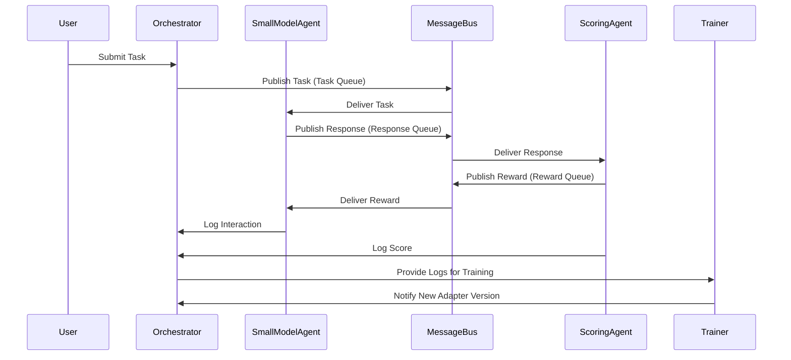

# Scoring Agent: Agentic Workflow Sequence Diagram

The following sequence diagram shows the detailed agent interaction and scoring flow relevant to the scoring agent:

```mermaid
sequenceDiagram
    participant User
    participant Orchestrator
    participant SmallModelAgent
    participant MessageBus
    participant ScoringAgent
    participant Trainer

    User->>Orchestrator: Submit Task
    Orchestrator->>MessageBus: Publish Task (Task Queue)
    MessageBus->>SmallModelAgent: Deliver Task
    SmallModelAgent->>MessageBus: Publish Response (Response Queue)
    MessageBus->>ScoringAgent: Deliver Response
    ScoringAgent->>MessageBus: Publish Reward (Reward Queue)
    MessageBus->>SmallModelAgent: Deliver Reward
    SmallModelAgent->>Orchestrator: Log Interaction
    ScoringAgent->>Orchestrator: Log Score
    Orchestrator->>Trainer: Provide Logs for Training
    Trainer->>Orchestrator: Notify New Adapter Version
```

---
